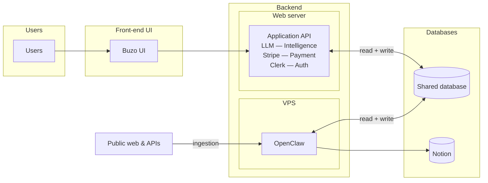

# Buzo — system architecture overview

Tables summarize intent and flows; **Mermaid** diagrams show topology. Stacks and hosting are **TBD** unless noted.

---

## At a glance

| Topic | Detail |
|--------|--------|
| **Purpose** | **Buzo** (UI) talks to an **application API** with **three** integrations: **LLM (Intelligence)**, **Stripe (Payment)**, **Clerk (Auth)** — see [Application API: three pillars](#application-api-three-pillars). **OpenClaw** ingests **public web & external APIs**. Both backends use one **shared database** (**read + write** each). **Notion** is an extra sink from OpenClaw. |
| **Front-end UI** | **Buzo** — React / Vite; square-framed **Front-end UI** group in diagrams. **Vercel** |
| **Web server** | **Application API** on **Render** (REST / GraphQL / tRPC — TBD). Houses **LLM**, **Stripe**, and **Clerk** server-side (details in the pillars table). Square-framed **Web server** group; serves the client over **HTTPS** only (no direct DB/Notion from the browser; **no** Stripe secret / LLM API keys in the client). |
| **VPS** | **OpenClaw** — scheduled / event-driven crawlers; **OVHcloud**. Square-framed **VPS** group in diagrams. |
| **Shared database** | PostgreSQL. **Dev vs prod hosting options** are recorded in [Database: dev and production](#database-dev-and-production). Diagrams still show one logical store. |
| **Notion** | Workspaces / DBs; optional notes, review, editorial workflows — **not** assumed to hold authoritative app transactions unless you decide otherwise. |
| **POC (~100 users)** | **Clerk** is used for **real auth** during the POC (not a placeholder). Flow, keys, and migration notes: [poc-rollout.md](./poc-rollout.md). |
| **Diagram styling** | Mermaid `%%{init: …}%%` sets **square** subgraph corners (`primaryBorderRadius` / `secondary` / `tertiary` = `0`). Some viewers ignore this. |

---

## Application API: three pillars

Everything below runs on the **Application API** (same **Web server** / **Render** deploy unless you split services later). The UI calls **your** API; **your** API talks to vendors with **server-only** secrets.

| Pillar | Integration | Role on the API |
|--------|-------------|-----------------|
| **Intelligence** | **LLM** (provider TBD, e.g. OpenAI / Anthropic) | Orchestration, prompts, tool/function calling, guardrails, optional **RAG** or retrieval against **your** DB. Tokens and base URLs stay **server-side** only. |
| **Payment** | **Stripe** | **Checkout**, **Customer Portal**, subscriptions or one-time charges; **webhook** endpoint with signature verification; persist billing state to **shared DB** idempotently. |
| **Auth** | **Clerk** | Sign-in UX (often via Clerk components/SDK on the UI hitting Clerk); **API** validates **Clerk-issued** sessions/JWTs; **Clerk webhooks** for user lifecycle → map **Clerk user id** in Postgres. **Used in the POC** (~100 users); see [poc-rollout.md](./poc-rollout.md). |

**Cross-cutting (same API):** domain routes (feed, events, plan, profile), **read + write** to **shared database**, and any orchestration that ties LLM output / Stripe customer / Clerk `userId` together.

---

## Diagrams

| Name | Use |
|------|-----|
| **Component (minimal)** | Users → UI → API → DB; web → OpenClaw → DB & Notion — compact left-to-right. |

---

## Component view (minimal)

### Component — flows

| From | To | Label / meaning | Dev deploy | Prod deploy |
|------|-----|-----------------|------------|-------------|
| **Users** | **Buzo UI** | Product usage | Vercel | Vercel |
| **Buzo UI** | **Application API** | <ul><li><strong>HTTPS</strong> — main app API (feed, events, plan, profile, settings).</li><li><strong>Clerk (Auth)</strong> — sign-in UI via Clerk SDK/components; <strong>Application API</strong> verifies sessions / JWT (no Clerk secrets beyond publishable key in UI).</li><li><strong>Stripe (Payment)</strong> — Checkout / Customer Portal / Elements as designed; payment sessions or intents created by <strong>Application API</strong>; browser never holds Stripe secret keys.</li><li><strong>LLM (Intelligence)</strong> — prompts/completions only through <strong>Application API</strong>; no LLM provider API keys in the browser.</li></ul> | Render | Render |
| **Application API** | **Shared database** | `read + write` (**bidirectional** arrow) | Neon | Supabase |
| **Public web & APIs** | **OpenClaw** | `ingestion` / fetches into the service | OVHcloud | OVHcloud |
| **OpenClaw** | **Shared database** | `read + write` (**bidirectional** arrow) | Neon | Supabase |
| **OpenClaw** | **Notion** | Write path for Notion-side content | Notion | Notion |

---

## Responsibilities (by box)

| Component | Host / frame | Role |
|-----------|----------------|------|
| **Buzo UI** | **Front-end UI** | Feed, discover, plan, profile, settings. **Only** talks to **Application API** in production (no direct DB or Notion). **Vercel** |
| **Backend (logical)** | **Backend** subgraph | Groups **Web server** + **VPS** side by side; same documentation boundary; can split or merge hosting later. |
| **Application API** | **Render**; **Web server** subgraph | **Three pillars:** **LLM (Intelligence)** — orchestration & tools, secrets on server; **Stripe (Payment)** — Checkout / Portal / webhooks / DB sync; **Clerk (Auth)** — verify sessions, webhooks, map user id. Plus domain logic (feed, events, plan, profile), **stack TBD**. **Full read–write** on shared DB. |
| **OpenClaw** | **OVHcloud** | Ingestion from web/APIs; **full read–write** on shared DB; optional **Notion** for notes, queues, editorial content. |
| **Shared database** | **Databases** | One store; both API and OpenClaw write — needs **ownership**, migrations, and **concurrency** rules. |
| **Notion** | **Databases** | Human-friendly docs / workflows; complements the shared DB. |

---

## Database: dev and production

Target: **one logical Postgres** for app data; **environment-specific** URLs and credentials. **Clerk** is the app’s **auth** provider; **Stripe** customer/subscription ids and **LLM**-related metadata (if persisted) live in **your** schema—see [Application API: three pillars](#application-api-three-pillars). If prod DB is **Supabase**, you can use it as **managed Postgres** and map **Clerk** user ids in RLS—or adopt **Supabase Auth** later.

| Environment | Option (preferred for current direction) | Notes |
|---------------|------------------------------------------|--------|
| **Development** | **Neon** (e.g. Free: CU-hours + storage quotas; scale-to-zero) | Cheap intermittent compute; good for schema work and local API dev. **Not** a full stand-in for Supabase `auth` / RLS—validate those on staging or a small Supabase dev project. |
| **Production** | **Supabase** (Pro when always-on / real limits matter) | Postgres + dashboard; use **service role** on the server; **Clerk** for sign-in unless you add Supabase Auth. RLS/client rules should align with your chosen identity (`Clerk` user id, etc.). Separate **prod** project from any Supabase dev/staging. |

**Alternatives (if we simplify or change later)**

| Pattern | When it fits |
|---------|----------------|
| **Supabase dev + Supabase prod** | Two projects (or orgs if plans differ); smallest drift; best for RLS-heavy apps. |
| **Neon dev + Neon prod + Clerk (or other auth)** | Keep Neon for DB everywhere; pay for auth separately; more glue (user id mapping, webhooks). |
| **Neon only (no Supabase)** | Fine if we never adopt Supabase Auth / hosted stack—otherwise overlaps with the preferred prod choice above. |

**Discipline (any split dev/host)**

- **Migrations** are the source of truth; apply the same ordered migrations to dev DB and prod (or generate from one tool).
- **Postgres version + extensions** (e.g. `pgvector`) should match or be documented where they differ.
- **Connection strings**: Neon direct vs Supabase **pooler** URL—use the right one per env; never commit secrets.
- **Staging**: Ideally mirrors prod DB + **Clerk** + **Stripe** (test mode) + **LLM** (vendor test project or mocked) so auth, payments, and intelligence paths behave like prod before release.

---

## Open decisions

| Area | What to decide |
|------|----------------|
| **Write boundaries** | Which tables/schemas are **API-owned**, **OpenClaw-owned**, vs **shared** (e.g. events after crawl). |
| **Notion vs DB** | Is Notion **source**, **sink only**, or **two-way** sync with the shared database? |
| **Backend packaging** | Keep **web server + VPS** separate or consolidate (VPC / k8s) while keeping one “backend” in docs? |
| **Arrow labels later** | If you add replicas, ETL, or webhooks, update labels **without** implying either backend is DB **read-only** unless you change the model. |
| **LLM vendor** | OpenAI vs Anthropic vs multi-provider; residency / retention / PII in prompts. |
| **Stripe scope** | Subscriptions vs one-time; tax; **Connect** if you pay out to third parties later. |

---

## Viewing the diagrams

| Where | How |
|--------|-----|
| **GitHub / GitLab** | Open the `.md` file; Mermaid usually renders in preview. |
| **VS Code / Cursor** | Mermaid preview extension, or paste into [mermaid.live](https://mermaid.live). |

---

## Related

| Doc | Topic |
|-----|--------|
| [system-cost.md](./system-cost.md) | Monthly infra list prices (Vercel, Render, Clerk, …). |
| [poc-rollout.md](./poc-rollout.md) | POC (~100 users) and beta → prod database migration. |
